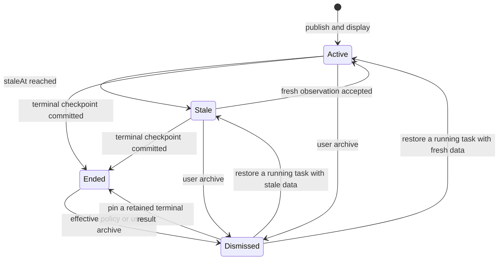

# ActivityKit reference for dynamic cards

Status: researched design reference, not an ActivityKit integration change.
Date: 2026-09-08. Contract: [Dynamic card lifecycle](lifecycle.md).

## 1. What we take from Apple

The relevant iOS feature is **Live Activities**, managed by ActivityKit. It is an
ongoing surface for a task or event. Apple recommends bounded activities and a
small amount of useful information, with detail available by opening the app.
[Apple Human Interface Guidelines](https://developer.apple.com/design/human-interface-guidelines/live-activities)

| Apple concept | Documented behavior | HiBoss design consequence |
| --- | --- | --- |
| `active` | The activity is visible and can receive updates | A living card updates in place |
| `stale` / `staleDate` | Content becomes outdated at a declared deadline | Emit server-owned `staleAt`; retain values with an outdated label |
| `ended` | The activity can remain visible, but receives no more content updates | Commit final data before showing the terminal result |
| `dismissed` | The activity is no longer visible | Remove the surface while retaining the task record |

Sources: [stale state](https://developer.apple.com/documentation/activitykit/activitystate/stale),
[ended state](https://developer.apple.com/documentation/activitykit/activitystate/ended),
[dismissed state](https://developer.apple.com/documentation/activitykit/activitystate/dismissed).
These rows cover the immediate task flow; they are not an exhaustive list of all
states exposed by every ActivityKit SDK version.

Apple separates ending from removal through `ActivityUIDismissalPolicy`: system
default behavior, immediate removal, or removal after a specified date within four
hours. Our wall adopts that distinction and adds `manual` for failed results and
boss-controlled persistence. Our 10-minute success and 1-minute cancellation defaults
are product proposals, not Apple defaults.
[Apple dismissal policy](https://developer.apple.com/documentation/activitykit/activityuidismissalpolicy)

## 2. Two independent lifetimes

A card's presentation and its underlying task have different lifetimes. Apple's
example explicitly allows removing a delivery Live Activity without cancelling the
order. A standard Live Activity can run for up to eight hours and remain on the
Lock Screen for up to four more; these are system-surface constraints.
[Apple Live Activity lifecycle](https://developer.apple.com/documentation/activitykit/displaying-live-data-with-live-activities)

For HiBoss, the wall presentation can be derived as follows; do not store a second
competing task state machine:

This is a **HiBoss wall projection**, not the ActivityKit transition graph. Restoring
our card does not reactivate an ended ActivityKit object. `paused`, `awaiting_data`,
`offline`, and local connection states still use their precise labels from the
lifecycle contract rather than being flattened into these illustrative states.

The wall has no eight-hour task limit. A monitor may run for days. If projected to
an iOS Live Activity later, each device gets its own ActivityKit presentation identity
linked to the durable `panelId`. System timeout or user removal affects only that
projection; it never sends the agent a task cancellation or wall archive command.

A user-dismissed system projection stays dismissed until explicit user action starts
a new one. Reconnect, producer updates, and view reconciliation must not repeatedly
recreate it. Pinning the wall card does not override iOS removal or duration limits.
Suppress automatic recreation on system expiry as well; do not chain new activities
to simulate an unlimited system surface. The task remains available inside HiBoss.

## 3. Explicit content deadlines and final results

Borrow three distinct pieces of information, with different owners and purposes:

| Field | Set when | Effect |
| --- | --- | --- |
| `staleAt` | A genuine data observation commits | Last values become visibly outdated |
| `terminalAt` | A lifecycle transition and final checkpoint commit | Producer content becomes immutable |
| `dismissAt` | The terminal outcome resolves a dismissal policy | An automatic wall card may leave the wall |

Producer presence remains `leaseExpiresAt`, independently of content freshness.
A producer can stay connected while its upstream data source stops responding.
Extending the lease cannot extend `staleAt`.

Apple's push protocol distinguishes start/update/end, supports `stale-date` and
`dismissal-date`, and sends final content with an end event. This informs our
observable behavior; HiBoss retains revision, epoch, and sequence checks for its
own relay instead of replacing those checks with an APNs timestamp.
[Apple ActivityKit push protocol](https://developer.apple.com/documentation/activitykit/starting-and-updating-live-activities-with-activitykit-push-notifications)

The final checkpoint and terminal outcome form one committed result. A successful
request send, APNs acceptance, or UI dismissal does not prove task completion or
answer acceptance. Show "Saving result" while the outcome remains ambiguous.

## 4. Compact summary and future iOS projection

Keep immutable identity separate from dynamic content, as our panel definition and
state already do. A future `PanelActivityAttributes` should carry a panel ID and
stable producer identity; its content state should carry stage, a headline metric,
optional meaningful progress, freshness deadline, and terminal outcome.

Use the same source summary for the wall and system projection, with a dedicated
layout for each size. Compact content emphasizes the agent/task identity and one
value; expanded content adds stage and the next useful action. Full tables, chart
history, form schemas, and draft answers stay inside the app.

ActivityKit limits combined static and dynamic content to 4 KB. Its presentation
cannot independently fetch network data; updates come through the app or ActivityKit
push notifications. Keep the system projection bounded and update it independently
of the high-frequency panel relay.
[Apple content constraints](https://developer.apple.com/documentation/activitykit/displaying-live-data-with-live-activities)

A future adapter must handle missing/delayed pushes, per-activity token changes, and
updates arriving after an activity ended. None of those transport outcomes changes
the canonical panel lifecycle.
[Apple push delivery guidance](https://developer.apple.com/documentation/activitykit/starting-and-updating-live-activities-with-activitykit-push-notifications)

Starting a system projection requires the boss to follow that task explicitly.
Neither publishing a panel nor pinning its wall card grants notification or system
activity consent. Ordinary metric ticks remain silent; existing attention rules
still own interruptions and unresolved decision counts.

## 5. Existing iOS implementation to reuse carefully

The repository already uses ActivityKit for decisions:

- [DecisionActivityAttributes](../../ios/Shared/DecisionActivity.swift) separates
  stable identity from mutable content.
- [DecisionActivityManager](../../ios/App/LiveActivity/DecisionActivityManager.swift)
  passes the decision expiration as `staleDate` and ends removed pending items.
- [RespondDecisionIntent](../../ios/Shared/RespondIntent.swift) supplies final content
  and requests dismissal after two seconds.

These are useful API examples, but they are not a durable panel lifecycle adapter.
The current intent suppresses reply errors and ends the activity regardless of
whether an answer was accepted. The new adapter must require an authoritative
receipt before presenting an answered/completed result. Decision expiration also
must not be reused as the telemetry freshness deadline of an unrelated monitor.

## 6. Acceptance additions

- A dropped update causes the existing card to become stale at its declared deadline.
- A new observation restores freshness without recreating or moving the card.
- End installs final content before the dismissal policy is evaluated.
- Dismiss leaves the running task, request state, and retained evidence untouched.
- A late data update cannot overwrite an ended result.
- User removal on one system surface does not archive the shared wall on other devices.
- Foreground reconciliation does not recreate a user-dismissed system activity.
- A monitor outlives an iOS projection without a synthetic failure or automatic restart.
