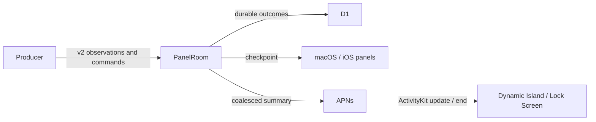

# Panels on Dynamic Island

Status: feasibility confirmed on 2026-09-08; panel-specific ActivityKit projection
and remote Live Activity delivery are not implemented by the lifecycle change.

## Existing foundation

The iOS application already enables `NSSupportsLiveActivities`, includes a widget
extension, and implements a decision Live Activity in:

- `ios/Shared/DecisionActivity.swift`: attributes and dynamic decision content.
- `ios/Widgets/DecisionLiveActivity.swift`: Lock Screen, compact, minimal, and
  expanded Dynamic Island presentations.
- `ios/App/LiveActivity/DecisionActivityManager.swift`: foreground reconciliation
  of pending decisions with the system's active activities.

Panels currently update their in-app wall through scoped WebSockets. They do not
have an ActivityKit attributes type, widget configuration, activity token registry,
or APNs Live Activity update path. The existing decision manager starts and ends
activities; it does not provide a general panel state synchronization service.

## Proposed presentation

| Surface | Content |
| --- | --- |
| Compact leading | Task or agent icon, with a recognizable paused/error state |
| Compact trailing | One meaningful metric, percentage, or elapsed time |
| Minimal | Status icon or progress ring |
| Expanded | Title, current stage, primary metric, progress when declared, and an Open panel link |
| Lock Screen | The expanded summary with source attribution and freshness |

A download can show `68%`, a test run `24/30`, and a monitor its current metric.
Do not invent percentages for monitors. Charts and forms remain in the app's
full panel. A system projection is a small native summary of the same task.

## State ownership

The panel remains canonical. `paused`, `completed`, `failed`, and `cancelled` all
come from its lifecycle. `staleDate` derives from the server's observation
freshness deadline; a producer heartbeat does not advance it.

Persist projection identity and user dismissal per device and panel. Boss-wide
wall placement and local system-surface visibility are separate preferences.
Opening the app must not recreate an activity the user dismissed. Ending a
system activity must not cancel its underlying task.

## Required implementation

1. Add `PanelActivityAttributes` with a small, bounded content state: panel ID,
   title, stage, metric, optional progress, task state, and observation deadline.
2. Add a native WidgetKit configuration for all presentations above.
3. Add an explicit device action to show a task as a Live Activity and reconcile
   its returned activity ID and system activity state. Start with one selected
   panel per device; do not automatically compete with every pending decision.
4. Register each activity's push token against the authenticated boss, device,
   panel, and activity instance. Handle token rotation and revoked access.
5. Deliver coalesced APNs `liveactivity` updates and terminal `end` events. The
   server must derive both from committed canonical state and retry delivery
   without replaying an older outcome over a newer one.
6. Verify foreground start, background/locked updates, termination, device
   dismissal, token rotation, stale content, and multi-activity competition on a
   physical Dynamic Island device. Simulator compilation alone is insufficient.

Foreground updates can call ActivityKit directly. Background correctness needs
APNs; the widget cannot keep the existing producer/subscriber WebSocket alive.
Remote start can be a later opt-in capability using the OS push-to-start flow.

## Platform constraints

Apple documents a maximum of eight active hours for a standard Live Activity,
with up to four additional hours of Lock Screen retention. These limits belong
to the system projection; a HiBoss monitor may continue for days. An ended
activity leaves Dynamic Island even while its final card remains on Lock Screen.

Combined static and dynamic ActivityKit data is limited to 4 KB. The system
controls presentation, visibility, and update budgets. It does not guarantee a
per-second live dashboard or a permanent Dynamic Island slot. A failed result
with HiBoss `manual` dismissal remains in Results even after the system removes
its Lock Screen presentation.

## Sources

- [Apple: Displaying live data with Live Activities](https://developer.apple.com/documentation/activitykit/displaying-live-data-with-live-activities)
- [Apple: Starting and updating Live Activities with ActivityKit push notifications](https://developer.apple.com/documentation/activitykit/starting-and-updating-live-activities-with-activitykit-push-notifications)
- [Apple: ActivityKit](https://developer.apple.com/documentation/activitykit)
- [Related HiBoss ActivityKit design analysis](activitykit-reference.md)
