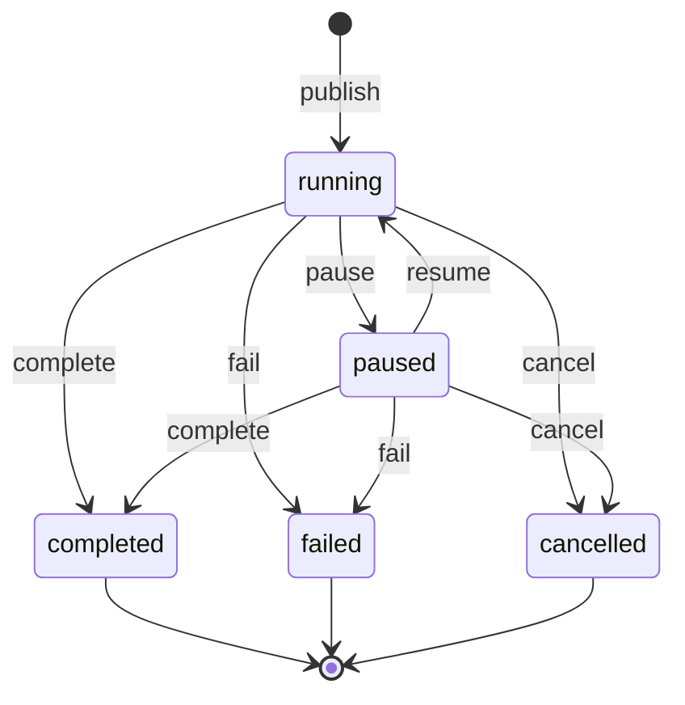

# Dynamic card lifecycle protocol

Status: core lifecycle implemented; durable requests and system projections remain planned. Date: 2026-09-08.
See [implementation and rollout status](implementation.md) for the tested contract and remaining work.
Scope: publication, ownership, freshness, terminal results, and wall visibility.
This document specializes the [panel protocol](protocol.md) and
[runtime contract](runtime.md). It owns lifecycle rules where those older proposals
are less specific. Retention timings below are proposed product defaults.
[ActivityKit reference and mapping](activitykit-reference.md) explains the Apple
Live Activities model that informs stale deadlines and result dismissal.

## 1. Product contract

A panel is a durable task surface. An agent owns its task state; the boss owns its
place on the wall. Disconnecting, dismissing a card, and ending work are different
operations. None is inferred from another.

| Dimension | Values | Authority |
| --- | --- | --- |
| Task | running, paused, completed, failed, cancelled | Owning agent, committed in D1 |
| Data freshness | awaiting_data, live, stale, offline | Server lease and observation receipts |
| Placement | automatic, pinned, archived | Boss preferences, committed in D1 |
| Local connection | connecting, connected, disconnected, resyncing | Each device |

`needs_input` is derived from open blocking requests, never a sixth task state.
A terminal card displays its outcome and final timestamp instead of becoming
"Offline" after its producer exits. A paused card displays "Paused" and the last
observation time instead of claiming its retained values are live.

No data tick, stale transition, or successful completion opens the interrupt island.
Only the existing attention contract determines interruptions. A failure result on
the wall is not implicitly a request for authorization or a synthetic inbox message.

## 2. Identity and publication

`panelId` identifies one task execution. `taskKey` groups related executions within
`(agentId, targetBossId)`; `sessionId` attributes work but does not own its lifetime.
A continuing task across sessions reuses its panel; a retry after a terminal outcome
creates a new panel with `supersedesPanelId`. A terminal panel never reopens.

Publication is idempotent by `(agentId, Idempotency-Key)`. The same key and body
returns the original panel; a changed body conflicts. A new execution requires a
new key, even if its initial document matches a prior execution. The CLI must stop
using only a document hash to identify all future runs of that document.

Creation durably records the definition, initial state, task state `running`, and a
`panel.created` outbox event. The client may display the initial state immediately,
with "Waiting for producer" until an observation is accepted. A publish receipt is
not a producer connection or proof the task's external process started.

Publication declares `mode: run | monitor`, `expectedUpdateIntervalSeconds`, and an
optional `ttlSeconds` visibility window. The default expected observation interval is
15 seconds; accepted range is 5–3600. `ttlSeconds` defaults to 3600 and accepts
60–604800. The interval describes freshness, not a rate limit; the TTL describes
visibility after the last accepted observation. A monitor has no automatic task
completion deadline and no inferred progress denominator.

The full producer document is `{ "task": ... }`: `stateSchema` and `initialState`
validate that root, while wire snapshots carry only the subtree as `task`. Patches
use `/task/...`. This follows current publication fixtures and validation code.

## 3. Task transitions



| Command | Preconditions | Durable result |
| --- | --- | --- |
| pause | running; expected versions/epoch match | paused; revoke producer lease; retain snapshot |
| resume | paused; expected versions match | running; new producer must acquire a new epoch |
| complete | running/paused; final checkpoint valid; no unresolved requests | completed plus immutable final snapshot |
| fail | running/paused; failure code and readable reason | failed plus final snapshot and request handling |
| cancel | running/paused; readable reason | cancelled plus final snapshot and request handling |

Lifecycle commands are reports from the owning agent. They do not kill an OS process
or prove an external operation has stopped. The producer reports pause/cancel only
when its executor has reached that condition. A future boss "Stop task" action
must request an executor operation and show acknowledgement separately. Archiving
is already a boss action and carries no execution authority.

Ordinary state updates are accepted only while running with the current lease.
Paused panels permit lifecycle commands and valid request submissions, but no live
producer writes. Definition replacement is allowed only while running/paused,
creates a new revision, and fences the previous epoch before new state is accepted.

Every terminal transition persists a final bounded checkpoint before acknowledging
success. If there have been no live writes, use the validated initial task state;
mark its provenance `initial`, rather than fabricating a last observation time.
A complete/fail/cancel command may supply a schema-valid `finalTask` replacement.
The command names the exact base checkpoint; intervening updates cause a conflict.

For all terminal commands, `openRequests: reject | withdraw` is explicit, with
`reject` as the default. `withdraw` closes only requests still open in the same
transaction and requires a reason. Accepted answers remain immutable. Completing
with an unanswered request must never silently imply an answer.

## 4. Producer lease and observation freshness

The server issues a random epoch and binds it to panel, definition revision, and
producer identity. Clients cannot select epochs. Lease duration is 45 seconds;
renew every 15 seconds. An expired lease cannot be renewed: claim a new one.
An unexpired lease can be replaced only by an explicit takeover naming its epoch.
All claims, renewals, updates, and control commands serialize per panel across sockets.

A new epoch begins at sequence zero with the latest compatible durable task state,
or the current definition's initial task state. The server emits that full baseline
before accepting patches. Restoring a snapshot does not refresh observation time.
Old-epoch writes, renewals, and lifecycle reports are fenced permanently.

Three events have distinct meanings:

- `lease.renew` proves producer presence and extends `leaseExpiresAt`.
- `state.update` commits observed data and updates `lastObservedAt` at server time.
- `state.unchanged` confirms the producer rechecked the source and its values remain
  unchanged. It names the exact current checkpoint and advances a separate
  `observationVersion`, without incrementing the state patch sequence.

Each accepted observation includes `staleAt`, computed by the server as
`lastObservedAt + max(15, 2 × expectedUpdateIntervalSeconds)`. It is a content
validity deadline, independent of `leaseExpiresAt` and terminal `dismissAt`.
A new accepted observation replaces it; a duplicate receipt, heartbeat, or refetch
preserves it. Clients can mark cached data stale without another server message.

Each panel also includes the derived `expiresAt`: `lastObservedAt + ttlSeconds`, or
creation time plus `ttlSeconds` before the first observation. Accepted `state.update`
and `state.unchanged` observations renew it; lease renewal and refetch do not.
Checkpoints and panel metadata return the server-derived value so clients do not
reimplement this policy.

Both observation commands use an `updateId`, exact revision/epoch, and base sequence.
An idempotent retry returns the original observation time; it cannot manufacture
freshness. A socket ping, client refetch, reconnect, or lease renewal is never a data
observation. Producers must not emit `state.unchanged` merely because a timer fired.

For a connected client observing a running task, evaluate in this order:

1. Without any accepted observation: `awaiting_data` (show retained initial values).
2. Without an unexpired producer lease: `offline` (retain the latest values).
3. Server time at or after the checkpoint's `staleAt`: `stale`.
4. Otherwise: `live`.

A disconnected/resyncing viewer shows its local connection status and cached time,
even if its cached lease would otherwise imply live. Server timestamps are UTC;
clients estimate server time using response time plus monotonic elapsed time and
refresh that estimate on foreground. A device wall-clock change cannot revive a lease.

Task state never changes on lease or visibility expiry. An abandoned run remains
running/offline until its owner reports a terminal outcome or the boss archives its
card. A lapsed running or paused card is hidden from the Active wall, not ended;
if its producer returns and observes, it becomes visible again. Automatic failure on
timeout would misclassify a healthy task during a network partition.

## 5. Visibility, results, and retention

Proposed defaults keep the live wall useful without deleting results:

| Condition | Automatic wall behavior |
| --- | --- |
| Running or paused | Remain visible, including stale/offline, until `expiresAt` lapses |
| Completed | Show result for 10 minutes after `terminalAt`, then move to Results |
| Cancelled | Show outcome for 1 minute, then move to Results |
| Failed | Remain until the boss acknowledges or archives it |
| Pinned | Remain visible regardless of automatic retirement |
| Archived | Hidden immediately; execution and stored evidence remain intact |

End and dismiss are separate presentation events, following ActivityKit's model.
A terminal commit ends producer updates and installs the final result. The wall may
continue showing that ended card until the effective dismissal policy permits removal.
The retained panel remains readable in Results after the card is dismissed.

`dismissalPolicy` is selected by the host from boss preferences and task outcome:

| Policy | Meaning | Normalized terminal deadline |
| --- | --- | --- |
| default | Resolve the product defaults above | Outcome-dependent |
| immediate | Remove after the final result is durably saved | `dismissAt = terminalAt` |
| after | Remove at a server-resolved absolute time | Non-null `dismissAt` |
| manual | Wait for acknowledgement or archive | `dismissAt = null` |

`manual` is a HiBoss extension, not an ActivityKit dismissal policy. Default resolves
to `after` for completed/cancelled and `manual` for failed; only the effective policy
is stored in terminal metadata. Boss settings may request immediate dismissal for
successful/cancelled outcomes. Producers cannot choose dismissal to conceal failures.
The lifecycle command's `result` contains final content, not visibility controls.

The effective policy and deadline are fixed at terminal commit. Producer traffic and
device activity cannot extend them. Pins and explicit boss archive/acknowledgement
remain independent overrides. Timed retirement is derived visibility, not a write
that archives a record. For running and paused cards, a lapsed `expiresAt` hides the
card without ending it; a pin overrides that hiding. No per-card server timer is
needed just to remove UI.

Unseen terminal results retain an unread marker in Results after leaving the wall.
Fetching a page never marks results read. Explicitly opening the final result records
`seenTerminalVersion` for that boss; acknowledging a failed result is a separate
explicit action. Marking a result seen on one device syncs to the boss's other devices.

Boss preferences use their own `preferenceVersion`; producer metadata writes cannot
overwrite them. `pin` selects pinned, `archive` selects archived, and `restore`
selects automatic. Restoring an already retired terminal panel opens it in Results;
pin it to return it to the wall. A pin/retirement race resolves by the latest
committed preference, not device arrival order.

Do not remove a card from under an active pointer, keyboard focus, or open detail.
Defer visual removal locally until interaction ends; the Results destination already
contains it. Retirement never closes an editor or discards its draft. Reduced Motion
uses an immediate visibility change once that interaction boundary is reached.

Terminal snapshots, definitions, and decisions remain until an explicit future delete
operation. Wall retirement is not a storage TTL. No automatic data deletion is part
of this protocol. A future retention policy must preserve referenced decision evidence.

## 6. Commands and versioned messages

This implementation uses `protocolVersion: 2`. The previous v1 relay
cannot enforce its required fields. Catalog version stays 1 because no component
schema changes. Implementations reject unsupported protocol versions explicitly;
do not run a legacy relay path with weaker lifecycle guarantees.

All control writes require `Idempotency-Key`, `expectedMetadataVersion`, and
`expectedDefinitionRevision`. Commands from a running producer also name
`expectedEpoch` (null only when no current lease exists). Terminal commands require
`expectedState: { epoch, sequence }`, or null if only initial state exists.

```http
POST /api/panels/panel_123/lifecycle
Idempotency-Key: finish-run-42
Content-Type: application/json
```

```json
{
  "protocolVersion": 2,
  "action": "complete",
  "expectedMetadataVersion": 3,
  "expectedDefinitionRevision": 1,
  "expectedEpoch": "epoch_7",
  "expectedState": { "epoch": "epoch_7", "sequence": 18 },
  "openRequests": "reject",
  "finalTask": { "completed": 24, "failed": 0 },
  "result": { "title": "24 tests passed", "message": "Checkout suite completed." }
}
```

A 200 response contains `operationId`, `metadataVersion`, task state, `terminalAt`,
`dismissalPolicy`, `dismissAt`, and the exact `finalSnapshot` reference. A 202 contains only the operation
receipt and `status: pending`; the client shows "Saving result", not "Completed".
`GET /api/panels/:id/operations/:operationId` resolves ambiguous responses.
All accepted operation receipts persist with the panel; retries return the same
outcome even after the task becomes terminal. Conflicting bodies return 409.

| Surface | Additional contract |
| --- | --- |
| POST /api/panels | v2 lifecycle policy and optional supersedesPanelId |
| POST /api/panels/:id/producer-lease | claim, renew, or explicit takeover |
| POST /api/panels/:id/lifecycle | pause, resume, complete, fail, cancel |
| PUT /api/panels/:id/definition | full revision replacement and epoch fence |
| PUT /api/panels/:id/preferences | placement plus expectedPreferenceVersion |
| POST /api/panels/:id/result-receipt | seen/acknowledged terminal version; idempotent |
| GET /api/panels?view=wall\|results\|archived | scoped metadata with authoritative lifecycle projection |
| GET /api/panels/:id/state | latest checkpoint, or immutable terminal checkpoint |

Every state/observation frame names panelId, definitionRevision, epoch, sequence,
observationVersion, lastObservedAt, staleAt, and leaseExpiresAt. Patches also name
baseSequence. Observation deadlines are null until an observation has been accepted. Control
frames are `panel.changed`, carrying metadataVersion, and `panel.preferences.changed`,
carrying preferenceVersion. They trigger authoritative reads, never speculative success.

Add a boss-scoped discovery subscription for creation, retirement-relevant metadata,
and preference changes. Existing per-panel subscriptions alone cannot discover a
new card. Reconnect/foreground reconciles the paginated list; append newly discovered
IDs in server creation order and retain existing wall slots. Never reset ordering to
"most recently updated". A missed discovery event must not strand a card forever.

## 7. Persistence and crash recovery

D1 owns lifecycle, definitions, terminal snapshots, result receipts, preferences,
control receipts, and an outbox. The existing recipient-scoped PanelRoom owns leases,
latest task snapshots, observations, and a durable per-panel pending-operation record.
Do not assume an atomic transaction across these stores.

For a terminal transition:

1. Authorize, check idempotency, then enter that panel's command queue. Validate
   versions, state cursor, finalTask, and required request handling.
2. In a DO storage transaction, persist a pending operation and freeze its exact
   final checkpoint. Fence producer writes before any cross-store await.
3. In one conditional D1 batch, claim the expected metadata version; insert the
   final checkpoint, terminal record, operation receipt, request withdrawals, and
   outbox event. Predicates recheck authorization and request state at commit time.
4. Mark the operation committed in DO storage, release the lease, and broadcast
   the new metadata version. Only a durable D1 commit permits a terminal receipt.
5. A lost response is resolved by the same operation key. A DO restart reloads its
   pending operation before accepting any writes for that panel.

If D1's outcome is unknown, keep the write fence and report pending. Recovery checks
the authoritative receipt before retrying. A definitively rejected command records
its rejection and releases the pending fence, but never revives the old epoch; a
running producer must claim a fresh one. Pause and definition replacement use the
same prepare/commit/reconcile pattern; resume cannot grant a lease before D1 commits.

A D1 batch is transactional, but a zero-row compare-and-set is not itself a SQL
failure. Guard every dependent insert with the winning operation identity, or enforce
a constraint that aborts the batch. An unconditional final snapshot/outbox insert
after a failed CAS is invalid. These are implementation requirements based on the
[D1 batch contract](https://developers.cloudflare.com/d1/worker-api/d1-database/#batch).

Use local DO transactions for the pending record/checkpoint/fence. Do not stretch
a local transaction across a D1 request. The available local transaction APIs are
specified in [DO storage](https://developers.cloudflare.com/durable-objects/api/sqlite-storage-api/).

Recovery alarms are idempotent. Each recipient DO schedules its earliest pending
repair; it does not create a new alarm for every telemetry sample. Alarms can execute
more than once and retries are bounded, so retain durable pending work and add a
periodic repair scan after retry exhaustion. See the
[alarm guarantees](https://developers.cloudflare.com/durable-objects/api/alarms/).

Answer-versus-terminal races resolve in D1: an answer that commits first stays accepted;
a withdrawal that commits first rejects the answer. No answer is deleted or converted
into approval by a task transition. Device drafts remain isolated throughout recovery.

## 8. Implementation sequence and acceptance gates

Migration 0035 adds lifecycle, final snapshots, preference and operation receipts,
and the control outbox. The v2 relay issues expiring server epochs and serializes
commands per panel. Native clients use server deadlines and a monotonic clock.
The implementation status page records verification and deployment boundaries.

1. **Durable lifecycle:** typed v2 commands, metadata CAS, final checkpoints, command
   receipts, and crash recovery. Verify publish → updates → complete → reload.
2. **Producer ownership:** server epochs, lease expiry/takeover, strict frame validation,
   per-panel serialization, idempotent observations, and schema-valid state patches.
3. **Wall lifecycle:** discovery, reconciled ordering, result presentation, pin/archive,
   retirement deadlines, and native result receipts on macOS/iOS.
4. **Requests:** integrate atomic request withdrawal and submission races when durable
   structured interactions ship. Do not pretend current local form capture is durable.

Required E2E cases: finish races an update; two producers claim concurrently; an old
epoch sends a late finish; a duplicate finish loses its response; D1 fails before/after
commit; DO restarts while fenced; a heartbeat continues while source observations stop;
a viewer reconnects to an old snapshot; a paused task resumes under a new epoch; a pin
wins against retirement; a new panel is discovered without restarting the app; a timed
result leaves an unread Results entry; staleAt elapses without any incoming frame;
a dismissed system Live Activity leaves the underlying task running; a terminal panel never accepts another patch.
