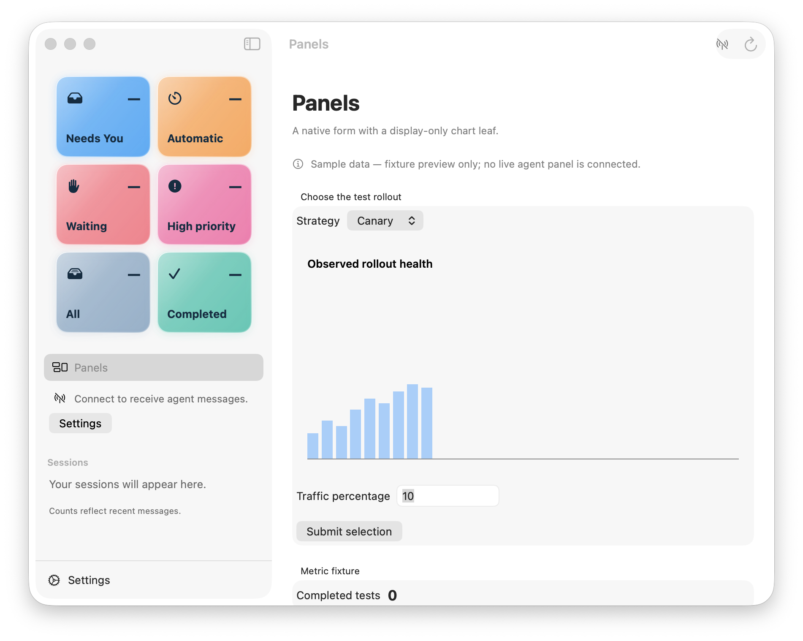
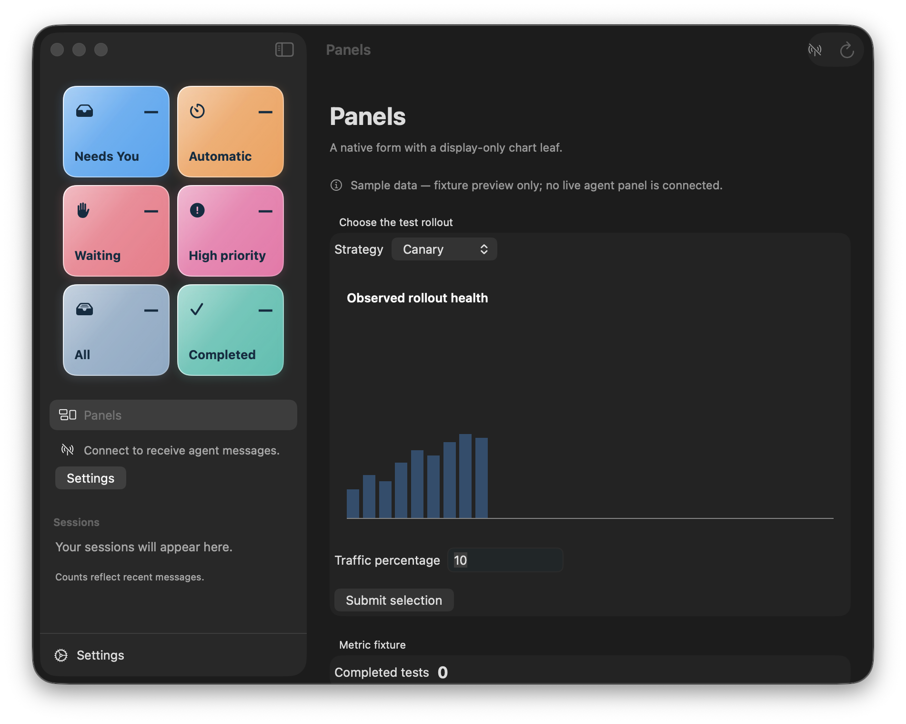

# Phase 0 client surface

Date: 2026-09-07

The macOS client now has a `Panels` destination gated by `HIBOSS_PANELS_DEMO=1`.
The destination is fixture-driven and says so directly on screen: “Sample data —
fixture preview only; no live agent panel is connected.” It does not show agent
attribution, freshness, or connection state for the panel.

The mixed fixture renders its `Select`, `NumberInput`, and `Button` as native
SwiftUI controls. Typing into the traffic field updated local state and showed the
native focus ring. The Submit action is host-owned and formats the assembled `/form`
answer for review; it does not call a server. The metric fixture renders below it
as a native Metric component.

The chart is the only web leaf. It is a non-focusable `WKWebView` using the seam
bridge for mount, content height, and renderer failure. The light and dark captures
show the chart bars, label, and system-adaptive colours in both appearances. The
dark-mode check used System Events and was restored to the original light setting.

## What I saw

- The native form, chart, explicit sample-data note, and metric fixture were visible
  in the built app bundle.
- The chart initially rendered with a collapsed bar area during the first visual
  check. The leaf was missing the seam spike’s explicit chart height; adding that
  height and rebuilding fixed it. The final captures show the bars in both themes.
- The metric fixture begins below the visible fold at the default window size. It is
  still present in the native scroll view and can be reached by scrolling; this is
  expected content overflow, not clipping.
- No remaining visual defect was observed in the final light or dark captures.

Because the task red line keeps `Package.swift` and the build script unchanged, the
two approved fixture payloads are source-owned in `Panels/PanelFixtures.swift` so
the release bundle remains self-contained. Their catalog content is copied from
`panel-runtime/fixtures/mixed-panel.json` and `metric-panel.json` without adding a
runtime fetch or a publication claim.

## Orchestrator verification — 2026-09-07

Rebuilt the bundle and looked at the running app rather than reading the report.
Independent captures that included system keychain prompts were removed during
public-release preparation. The light and dark demo images above remain available.

What holds:

- The existing overview sidebar is untouched and the new Panels entry sits beside it.
- The split renders as designed: a native `Picker`, a native number field and a native
  prominent button, with the web chart leaf **between** them, so the seam is inside the
  focus order rather than tacked on the end.
- Dark mode carries the whole window including the leaf — dark chart ground, adjusted
  series colour, no stranded light rectangle.
- The sample-data notice is present, native, and honest about there being no live panel.
- macOS tests remain at 121 passing; this surface is additive.

Two defects visible on screen that the delivery report does not mention:

1. **The chart leaf reserves far more height than it draws into.** Roughly 250 points of
   empty space sit between the "Observed rollout health" heading and the top of the
   plotted bars. The leaf is not oscillating or clipping — the height simply settles too
   large — so this is cosmetic rather than structural, but it makes the panel look broken.
2. **`LineChart` renders as bars.** The bundled asset draws `rect` elements; there is no
   line or polyline path. The catalog declares LineChart and the fixture asks for one, so
   the renderer is not honouring its own component contract. The seam spike has the same
   defect, which is where this asset came from.

Neither blocks the split, and both belong to the web leaf rather than the seam.

## Environment note

A freshly built bundle prompts for keychain access to `ai.hiboss.island.stable` on every
launch and re-prompts on each read. This is the ad-hoc signing behaviour the build script
already documents — an ad-hoc signature has no stable designated requirement, so the
cdhash changes every build and the stored item's ACL never matches. It is unrelated to
this work. Denying the prompt is safe here because the panels surface is fixture-driven
and needs no boss token; the screenshots above were captured that way.

## Chart leaf defect fix — 2026-09-07

Rebuilt the bundle and inspected the live `Panels` destination after launching with
`HIBOSS_PANELS_DEMO=1`. The new capture is `screenshots/panels-line-chart-fixed.png`.
The chart now draws a line, with the fixture's middle `null` visible as a break between
two line segments. The leaf height settles to the measured document content, so the
heading is followed by the plot without the former empty band above it. The keychain
prompt was denied without entering a password; the fixture surface remained usable.

## Tile wall verification — 2026-09-07

The rebuilt `HIBOSS_PANELS_DEMO=1` app showed seven producer-labelled tiles. Several
updates changed numbers in place without moving tiles. After the Research Desk
producer stopped, `Image pipeline benchmark` showed `Stale` beside live tiles; a later
check correctly progressed it to `Offline`. The captures are
`screenshots/panels-wall-live.png`, `screenshots/panels-wall-stale.png`, and
`screenshots/panels-wall-dark.png`.

One cosmetic issue was visible: wide chart-series tiles reserve more blank vertical
space than their compact scalar summaries use. The wall remained readable, and the
full-panel path still renders charts and tables through the existing web leaf.
