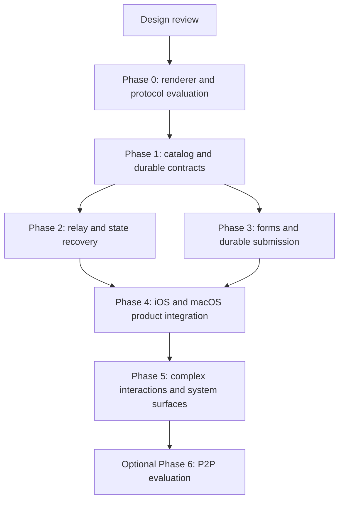

# Live Panel Delivery and Verification Plan

Status: planning only. Date: 2026-09-07.
Parent: [Product design](../live-panels-design.md).
Contracts: [Protocol](protocol.md), [runtime](runtime.md).

## 1. Authorization and completion boundary

The current deliverable is this design package. No implementation phase starts as
part of writing it. All commands, migrations, package additions, screenshots,
benchmarks, and release steps below describe future work.

The design records recommendations and explicit evaluation gates. A gate means
evidence needed before choosing a production approach; it does not imply an
approval prompt is required for every reversible engineering action once the user
has authorized implementation.

## 2. Dependency order

Phases describe dependencies, not staffing commitments or automatic delegation.
Storage and recovery are prerequisites to claiming that a working prototype is a
reliable product. No calendar estimate is asserted before Phase 0 resolves renderer
scope and baseline measurements.

## 3. Work packages and exit gates

### Phase 0 — evaluate renderer and freeze the bounded language

Deliverables:

- Pin a json-render package version and source commit; inspect actual APIs, license,
  transitive dependencies, expression handling, and schema validation behavior.
- Define the smallest useful HiBoss catalog and the answer-schema subset.
- Build representative fixtures: a metric/line chart/progress view and a branching
  form with validation, a user draft, and a submitted read-only state.
- Compare bundled React/WKWebView with a bounded SwiftUI adapter on both platforms.
- Verify local content loading, typed bridge messages, input focus, appearance,
  accessibility, chart interactions, content height, and runtime memory.
- Verify the Swift WebSocket authentication handshake and a DO hibernation/recovery
  experiment in an isolated development environment when implementation is authorized.

Exit evidence: renderer decision record, native-contract exception or native-adapter
scope, dependency lock, schema conformance fixtures, and measured prototype budgets.
Reject an approach that cannot keep input reachable or support accessible form errors.
No requirement to implement both production renderers.

### Phase 1 — catalog, publication, and durable control records

Deliverables:

- Typed protocol envelopes, catalog manifest, path-aware errors, fixture corpus.
- Scoped panel publication, immutable definitions, lifecycle compare-and-set, and
  read APIs with bounded pagination.
- D1 schema/index design and atomic submission proof, including unique constraints
  and crash cases. DO/D1 revision fencing must be demonstrated before live updates.
- Request publication and immutable context/answer schemas; signed payload design
  extending existing provenance handling without weakening key-bound authentication.
- CLI and MCP catalog/validate/publish/read operations with identical semantics.
- Native summary metadata and stable attention/history identifiers.

Exit evidence: agent-to-server publication E2E; invalid catalog rejection; scoped reads;
repeat publication returns one ID; concurrent revision writes have one winner.

### Phase 2 — relay, producer lifecycle, and recovery

Deliverables:

- New PanelRoom binding, hibernating sockets, scoped tickets, subscription fan-out,
  publisher lease, bounded state patches, durable latest snapshots, and receipts.
- Agent producer runtime with NDJSON input, batching, backpressure, and resume logic.
- Native host connection/store independent of the renderer; atomic subscription
  snapshot boundary; revision-aware foreground recovery.
- Durable control outbox dispatch with retry and reconciliation. Proposed recovery
  sweep runs at most one minute apart, separate from existing unrelated scheduled
  work; active dispatch is event-driven. Validate cost before changing cron cadence.
- Metadata summaries update on semantic changes or at a bounded cadence, not every tick.

Exit evidence: one producer updates both clients; a DO restart preserves acknowledged
state; a missing patch triggers snapshot recovery; revocation and slow consumers remain
isolated; an old producer cannot write after takeover or definition replacement.

### Phase 3 — forms and structured decisions

Deliverables:

- Field bindings, conditional activation, deterministic validation, protected local
  drafts, host-owned submit review, and asynchronous submission status.
- Purpose-specific native signing, server validation, atomic accepted answer and
  delivery outbox, durable receipt lookup, and agent acknowledgement.
- Request supersession, expiry, withdrawal, correction links, and final read-only view.
- Agent `request_wait` and delivery recovery without interpreting timeout as an answer.
- Explicit permission rules for intake, review, decision, and authorization requests.

Exit evidence: real agent publication -> user form input -> accepted structured answer
-> agent receipt flow, plus two-device collision, lost response, and form-revision races.
Successful data entry alone is not completion of this phase.

### Phase 4 — native product integration and initial release candidate

Deliverables:

- iOS attention-first Home, native previews, full panel/form detail, deep links,
  reconnect presentation, and lifecycle history.
- macOS overview integration and ordinary-window panel detail with native navigation.
- Consistent counts and deduplication across pending requests, session transcript,
  and panel detail. Exactly one attention entity per open request.
- Preserve progress feed semantics: final report publication is deliberate and
  idempotent; live updates never become posts or repeated messages.
- Catalog availability reporting, incompatible-client messaging, feature switches,
  local cleanup, usage quotas, and an operational export/delete procedure.
- Accessibility, localization, and desktop/mobile layout validation on real devices.

Exit evidence: complete acceptance matrix below; deployed-environment recovery and
cost report; feature-disable exercise with readable existing records. Production
deployment and release require a later implementation/release instruction.

### Phase 5 — richer surfaces and interactions

Deliverables, independently releasable after the core flow is sound:

- macOS left/right edge docking, collapse/expand, user pinning, display migration,
  keyboard access, and focus behavior across Spaces/full-screen/sleep-wake.
- Multi-step forms, date/time with explicit timezone, selectable comparison tables,
  batch review keyed by stable item IDs, and read-only remote preview actions.
- Native Live Activity summary contract, opt-in, APNs start/update/end where supported,
  bounded payload, privacy settings, and system activity lifetime handling.
- Optional richer chart component after evaluating catalog/schema expressiveness.

Exit evidence: each new interaction covers draft preservation, validation, submission,
and accessibility; docking never strands a window; system summaries match saved state
without implying guaranteed background streaming.

### Optional Phase 6 — P2P

Start only after recording a measurable bandwidth/latency need or an explicit privacy
requirement. Define direct-preview semantics before adding a transport library.

Evaluate producer/native WebRTC libraries, STUN/TURN credentials, peer identity,
ICE restarts, cellular and restrictive networks, multi-device upload duplication,
and transitions back to relay. Keep durable decisions on the accepted server path.

Exit evidence: documented direct/TURN connection rates, setup latency, battery/CPU,
actual relay savings, and zero cursor confusion during transport switching. If these
do not justify the complexity, retain WebSocket relay as the supported transport.

## 4. Proposed repository boundaries

| Area | Future responsibility |
| --- | --- |
| `panel-runtime/` | Catalog, upstream adapter, component registry, web assets, renderer fixtures |
| `server/src/panels/definition/` | Publication, metadata/lifecycle, schemas, persistence |
| `server/src/panels/relay/` | Room, tickets, lease, state store, backpressure |
| `server/src/interactions/` | Questions, answer validation, acceptance, delivery |
| `server/src/message-security/` | New signed submission purpose and provenance |
| `HibossKit/.../Panels/` | Shared typed client protocol, networking, reducer, cache |
| `HibossKit/.../Interactions/` | Request state, draft identifiers, submission state machine |
| `ios/App/Panels/` | Home preview/detail adapters and selected renderer host |
| `macos/.../Panels/` | Overview/detail adapters and desktop companion |
| `cli/src/commands/` and `cli/src/client/` | Thin command and transport entry points, split into feature submodules |
| `mcp/` | Structured tool definitions and durable answer delivery integration |

Paths are planning boundaries, not directories created by this task. Avoid adding
another large route file or putting renderer-specific types into all clients.
Keep source files <=300 lines, functions <=50 lines, and feature modules <=10 files;
split subfeatures as needed. Keep documentation files <=500 lines.

Every source file gets a purpose/exports/dependencies header. Use strict types,
branded IDs, explicit Result unions, dependency-injected transport/storage, and
centralized limits. Rust dependencies must use only required features; never `full`.
Do not run `cargo fmt` unless explicitly requested.

## 5. Proposed operational limits

These are starting product limits and test targets, **not measured results or
Cloudflare/Apple platform limits**. Phase 0/2 measurements may revise them explicitly.

| Limit | Starting proposal |
| --- | --- |
| Spec/form size | 128 KiB each, UTF-8 uncompressed |
| UI tree | 200 elements, depth 12, bounded repeats |
| Producer state | 256 KiB total, including chart windows |
| Incremental update | 32 KiB, at most 100 operations |
| Submission | 64 KiB, at most 100 declared fields |
| Time-series display | 2,000 points total per panel initially |
| Accepted update rate | 2 commands/second/panel, burst capacity 10 |
| Producer lease | 60 seconds, renewal every 20 seconds while producing |
| Update deduplication | 10 minutes, maximum 2,048 receipts per active epoch |
| Connection ticket | Single use, expires in 60 seconds |
| Socket authorization | Renew within five minutes; stop on failure |
| Receiver backlog | 512 KiB or 100 unsent updates before snapshot resync |
| Per recipient | 20 active panels, 4 device sockets, at most 20 publisher sockets |
| Formal write rate | 10 submission attempts/minute/device with bounded bursts |
| Foreground UI apply | p95 <100 ms after host receives a valid update |
| End-to-end live update | p95 <1 second in an explicitly recorded network profile |
| Reconnect recovery | Latest snapshot visible within 3 seconds after a successful authenticated connection |
| Renderer memory | Target <=80 MiB incremental cost per expanded panel; measure process totals |

Control receipts and definitions also need quotas: initially 100 definition revisions
per panel, 100 open requests per recipient, and a configurable total retained-data
budget. Refuse new writes with clear capacity errors; never delete accepted decisions
silently to meet a quota. Provide export/delete operations before broad deployment.

Define freshness using a declared expected interval clamped to 5 seconds..1 hour;
stale after the greater of 30 seconds or three expected intervals. Connection and
source observation timestamps remain distinct. Terminal panels show completion time.

## 6. Cost model and observability

For each test workload record active publishers, subscribers, accepted updates/sec,
average frame bytes, duration, and snapshot size. Approximate fan-out volume as
`accepted updates * average bytes * subscribers`, with snapshots/reconnects added.
At a continuous 2 updates/sec, one panel produces 172,800 accepted updates/day;
that is a sizing scenario, not a suggested default for every task.

Measure Worker/DO request work, active duration, storage operations, D1 control writes,
R2 artifacts, APNs work, and optional TURN traffic against current rates. Hibernation
saves idle duration; it does not make a busy stream free. Do not quote a dollar budget
until observed workloads are available. [Cloudflare pricing](https://developers.cloudflare.com/durable-objects/platform/pricing/)

Record panel/request IDs, revisions, epoch/sequence, error codes, timings, queue
depth, rejected bytes, resync reason, and outbox age. Exclude answers, form drafts,
credentials, raw spec text, and signed payload bodies from operational logs.
Track accepted/delivered/acknowledged separately; a socket send is not a receipt.

Alerts cover rising validation failures, stale outbox work, storage failures, excessive
resync, auth-renewal failures, renderer crash rate, and quota pressure. Coalesce alerts;
never issue a notification for every telemetry error.

## 7. Acceptance matrix

Write E2E tests for critical journeys before their implementation. Use integration
tests for D1/DO semantics and shared conformance fixtures; unit tests target reducers,
validation, ordering, and edge cases. Do not substitute mock-only tests for native
keyboard, WebView, or cloud lifecycle behavior.

| Scenario | Required evidence |
| --- | --- |
| Publish and observe | CLI/MCP publish renders the same values in iOS and macOS |
| Durable latest state | Terminate/restart DO after acknowledgement; new client gets saved values |
| Snapshot race | Update during subscribe/resync; no gap or duplicate array append |
| Producer fencing | Old session cannot write after lease takeover or new definition |
| Slow device | One throttled receiver cannot delay a healthy receiver or producer |
| Branching form | Hidden inactive fields do not block or leak into answers |
| Invalid submission | Client errors are accessible; direct API invalid answers are also rejected |
| Draft isolation | Producer update, navigation, view remount, and app restart preserve draft |
| Question changes | Old draft cannot answer a changed revision without explicit restart |
| Two-device race | One accepted answer/outbox record; other device shows resolved |
| Response lost | Receipt lookup returns accepted submission; retry creates no duplicate |
| Transaction crash | No claimed request without answer and outbox; no answer without claim |
| Expiry/cancel race | Server time/CAS picks one result; no fabricated default answer |
| Agent offline | Answer persists; resumed agent receives and deduplicates it |
| Scope/signature | Wrong recipient, viewer, replay mutation, downgrade, and expired tickets fail |
| Malicious declaration | Cycles, deep trees, prototype paths, giant arrays, and invalid actions fail safely |
| UI recovery | One renderer failure leaves native Home/navigation and drafts usable |
| Attention integration | Same request counted once; resolution updates all relevant surfaces |
| Platform lifecycle | iOS background/foreground and macOS sleep/wake recover honestly |
| Layout/accessibility | Small screen, large text, VoiceOver, keyboard, light/dark, reduced motion |
| Feature disabled | Stop new publications; existing answers/history remain readable and reconcilable |

For macOS visual changes, build and inspect the app as required by the existing
[native contract](../macos-design-v2.md). Record screenshots and actual-device results
for the selected renderer. Future checks include server typecheck/tests, targeted
Swift package tests, iOS UI tests, CLI checks, and MCP tests appropriate to each change.

## 8. Release and rollback plan

- Separate switches control publication, live relay, interactive submission, desktop
  docking, and optional P2P. A disabled entry point returns an explicit typed response.
- Deploy server/catalog support before enabling corresponding client publication.
  Clients advertise exact capability versions; unsupported specs are not interpreted.
- Roll out to internal paired devices, then a limited recipient set, then wider use
  after correctness, accessibility, and cost gates pass.
- Preserve immutable records when disabling a feature. Submission lookup and delivery
  reconciliation remain available for in-flight decisions. Do not fabricate a legacy
  text answer to hide a disabled renderer.
- Database changes are additive for these new entities. Rollback disables writes and
  retains data; no automatic destructive down-migration. Future format changes use an
  explicit coordinated version change, not compatibility shims.
- When a future version release is committed, push its version tag with or immediately
  after the commit push, following the repository release rule. No release occurs now.

## 9. Open decisions and how to close them

| Decision | Default in this plan | Evidence/owner needed before implementation proceeds past gate |
| --- | --- | --- |
| Production renderer | Evaluate bundled React first | Client work: native fidelity, accessibility, memory; Phase 0 |
| Native contract exception | None silently assumed | Record exact scope or choose SwiftUI; Phase 0 |
| Upstream/schema versions | Exact pins, bounded subset | Protocol work: API/source inspection and conformance fixtures; Phase 0 |
| Structured answer transactions | D1 atomic conditional operation | Server work: executable concurrency/crash proof; Phase 1 |
| Catalog chart library | Small line/bar component | Renderer work: bundle size, license, accessibility; Phase 0 |
| Default freshness/update cadence | Bounded proposals above | Real producer workloads; Phase 2 |
| Retention/data capacity | Keep durable decisions; explicit deletion | Product/operations: expected use, export/delete UX; Phase 4 |
| Remote preview actions | Explicit, read-only, cancellable | Interaction work: action scoping and stale-result behavior; Phase 5 |
| P2P and opaque relay | Deferred | Product requirement plus measured transport benefit; Phase 6 |

## 10. Design review checklist

- [ ] Confirm the proposed user journeys and first-release boundary.
- [ ] Resolve the production renderer gate before editing client UI architecture.
- [ ] Freeze catalog/schema rules and source version with shared fixtures.
- [ ] Validate authority, cross-store recovery, and submission transaction design.
- [ ] Accept measured device/network/cost budgets rather than these initial targets.
- [ ] Authorize a separate implementation task when ready to begin construction.
