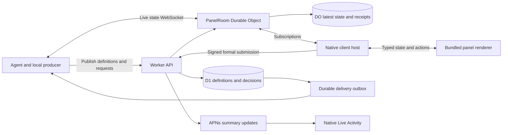

# Live Panel Runtime and Transport

Status: proposed, unimplemented. Date: 2026-09-07.
Parent: [Product design](../live-panels-design.md).
Wire semantics: [Protocol](protocol.md). Validation gates: [Delivery plan](rollout.md).

## 1. Architecture

Definitions and decisions use authenticated HTTPS. Live state uses a separate
bidirectional channel. The native host owns networking, credentials, subscription
selection, local drafts, and authoritative status. React only renders the supplied
state and emits typed user intents.

json-render handles UI interpretation; it does not provide HiBoss tenancy, a durable
task store, authenticated agent delivery, or a P2P connection service.

## 2. Renderer boundary

The first evaluation uses `@json-render/core` and `@json-render/react`, with a small
HiBoss component registry packaged into the app. No runtime compilation or downloads
of agent-authored TSX, npm modules, HTML, scripts, CSS, or renderer bundles.

The native shell sends validated data messages using typed serialization, never
JavaScript source interpolation. A renderer instance is assigned a panel and request
context by the host. It cannot choose another context by sending different IDs.

Proposed bridge messages:

| Direction | Message | Purpose |
| --- | --- | --- |
| Host to view | `mount` | Definition, state baseline, profile, appearance |
| Host to view | `applyTaskState` | Validated task delta or snapshot |
| Host to view | `requestStatus` | Open/replaced/resolved state from server |
| View to host | `draftChanged` | Declared answer paths only; save locally |
| View to host | `actionRequested` | Registered action name and typed arguments |
| View to host | `contentSizeChanged` | Bounded layout measurement |
| View to host | `renderFailed` | Sanitized failure classification |

Actions are divided into local navigation/filtering, explicit read-only previews,
and durable submission. Only direct user activation may request a formal submission;
watchers, mount effects, remote state updates, and timers cannot submit it. Submission
parameters are rebuilt from the host's active request and validated draft, not a
renderer-provided HTTP body. Authorization review uses host-owned native presentation.

Use a dedicated local content origin, nonpersistent web storage, restrictive content
policy, no arbitrary navigation, and no direct network access from panel components.
Images and artifacts use scoped host-mediated fetches. Check scheme/origin/frame on
bridge calls, enforce size/rate limits, and discard calls from obsolete mounts.
The exact WKWebView loading and content-policy implementation is a Phase 0 experiment,
not an assumption that WKWebView alone constitutes a complete security boundary.

The bundled registry owns all executable behavior. Validate declarations before
mounting, enforce tree/data limits while rendering, and handle process termination.
An invalid panel gets a native error and usable navigation; it must not blank Home.
The server repeats action authorization regardless of client-side checks.

### Native fidelity and renderer selection

Keep native previews on Home and the desktop collapsed rail. Initially mount only
the selected expanded panel. Start with at most one active web view on iOS and two
on macOS; additional panels retain data without active rendering. These are proposed
product budgets, subject to device measurements.

Compare the React renderer with a bounded SwiftUI catalog adapter for actual input,
focus, scrolling, text scaling, chart access, and dark/light appearance. Native
support means implementing spec traversal, bindings, repeats, validation, and actions;
it is not a mechanical JSON-to-SwiftUI conversion. Do not commit to maintaining both
full renderers in v1. Record the chosen production strategy at the Phase 0 gate.

Apple's dynamic-code rules and exceptions depend on the actual delivered behavior.
Bundling code and delivering JSON reduces our executable surface but does not
guarantee review approval. Recheck the specific implementation against sections 2.5.2
and 4.7 before shipping. [App Review Guidelines](https://developer.apple.com/app-store/review/guidelines/)

## 3. Relay topology

Use a new SQLite-backed `PanelRoom` Durable Object namespace, independent of the
existing Discord gateway. Initial room identity is the explicit recipient `bossId`.
Do not create a global room, use project names as room identity, or open one device
connection per chart. An agent with several authorized recipients connects to their
rooms separately; initial panels have one recipient room.

Worker middleware verifies credentials and delegates room coordination to the DO.
Both agents and devices initiate outbound WebSocket connections. Within a room,
subscriptions name panel IDs and each subscription is checked against ownership
and current recipient visibility. A room membership is not blanket write permission.

Use the WebSocket Hibernation API for accepted incoming connections. Persist compact
connection attachment data needed for reconstruction, while latest snapshots and
leases live in DO storage. Hibernation resets ordinary in-memory state; it is not a
snapshot mechanism. Continuous messages keep incurring work and storage costs.
[Cloudflare WebSocket guidance](https://developers.cloudflare.com/durable-objects/best-practices/websockets/)

Avoid busy polling or a periodic timer per panel. Use runtime-supported ping handling,
explicit incoming events, and a bounded alarm for authorization/lease deadlines.
Benchmark the effect of connection reauthorization and alarms on idle costs.

### Connection authorization

The native host/producer requests a single-use ticket over authenticated HTTPS.
The ticket names room, credential identity, role, permitted operations, and expiry.
It expires after 60 seconds if unused. Send it in a supported native WebSocket
handshake header; do not put long-lived secrets in URLs or logs.

The DO atomically consumes the ticket and binds identity to the socket. Bindings
must not be client-editable. Sessions require reauthorization within five minutes;
failed renewal closes the socket and subscriptions. Scope changes trigger best-effort
immediate invalidation plus this bounded maximum window. Formal submissions and
control writes always check current D1 authorization, not a cached socket role.

Exact HTTP-upgrade header behavior must be verified on the selected Swift networking
API. Direct browser-to-relay connections are outside v1; the native host is the bridge.
No credential downgrade path is added if the chosen API fails the handshake test.

## 4. Authority and persistence

| Data | Authority/store | Recovery and retention |
| --- | --- | --- |
| Panel owner, recipient, task identity, lifecycle | D1 `panels` | Stable record, explicit archive/delete |
| Immutable definitions and initial state | D1 `panel_definitions` | Exact revision lookup |
| Producer lease and latest accepted state | DO storage | Reconstruct after sleep/restart |
| Active state-update receipts | DO storage | 10-minute bounded idempotency window |
| Request heads and immutable revisions | D1 `interaction_requests` / `interaction_revisions` | Preserve submitted context |
| Answers and provenance | D1 `interaction_submissions` | Immutable while record retained |
| Formal delivery and projection work | D1 `panel_outbox` | Retry until acknowledged or explicitly abandoned |
| Final bounded snapshot | D1, linked from terminal panel | Readable even if live DO is unavailable |
| Large report artifacts | R2, authenticated references | Separate upload/ownership checks |
| Pins and archive preferences | D1, per boss | Sync preferences, not task status |
| Unsubmitted form draft | Protected device-local storage | Keyed by account/request/revision |

Table names describe future entities, not migrations created in this task. Add
indexes for recipient/lifecycle, owner/task key, request status/deadline, delivery
cursor, and pending outbox work. Unique constraints enforce definition revision,
submission ID, and one accepted answer per request. No live sample triggers a D1 write.

### Cross-store consistency

There is no assumed transaction spanning D1, DO storage, and R2. Use explicit
revision fencing and durable retry records, not a fire-and-forget second write.

- Route definition/lifecycle/lease commands through a per-panel logical command
  queue in its DO. Serialize these commands across asynchronous storage calls;
  a single-threaded runtime alone is not proof of that ordering.
- Commit a new definition and its outbox event in D1. Its immutable initial state
  makes it recoverable if DO activation fails. A subsequent DO command reloads the
  authoritative revision before accepting state for it; old producer epochs are fenced.
- State snapshots always name their definition revision. A reader may fetch that
  exact definition or wait for initialization; it must never combine a new spec with
  an unrelated old snapshot. Show a reconnecting/updating state in that interval.
- State acknowledgements occur only after DO storage commits. If a broadcast fails
  afterward, reconnect supplies the committed snapshot. Unacknowledged data is retried
  or reconciled according to the protocol's receipt window.
- Completion first fences live updates, captures the latest durable snapshot, then
  conditionally commits the terminal panel, final snapshot, and request withdrawals
  in D1. If that commit fails, expose completion as pending and retry idempotently.
- Formal submission remains a D1 atomic operation. Its predicate also checks the
  panel permits submission, so task cancellation and answering have a defined winner.
- Notify DO subscribers after a D1 control commit. Durable outbox delivery repairs
  lost notifications. Clients also fetch current metadata on reconnect/foreground.
- Store R2 uploads before publishing references; unreferenced uploads can be garbage
  collected. Never acknowledge an artifact-bearing final report with a missing object.

Initial retention: keep definitions needed by retained decisions, submissions, final
snapshots, and latest active state until explicit deletion. Chart arrays are bounded
by the protocol limits; no claim of full historical reconstruction. Remove local drafts
on explicit discard/account removal, or after a terminal request has been acknowledged
by the device. Do not delete an unresolved/ambiguous submission draft automatically.

Deletion is a separate future owner action with a retention preview. It must revoke
subscriptions, remove DO/D1/R2 data, and persist a tombstone until cleanup completes.
Archive is available earlier and never silently deletes decision evidence.

## 5. Reliability and load control

Agent SDKs coalesce superseded scalar values before sending, and batch sample arrays.
They cannot coalesce away formal decisions, definitions, or result records. A producer
should stop expensive visualization-only sampling when no subscriber needs it, while
maintaining meaningful state/checkpoints for later recovery.

Each subscriber has bounded pending bytes and update count. If it falls behind,
replace pending state deltas with a current snapshot; never drop a patch then keep
applying dependent patches. Disconnect a persistently slow receiver with a resync
reason. One slow device must not block other subscribers or producer acknowledgement.

Use capped exponential reconnect with jitter, immediate foreground recovery, and
fresh authorization after authentication failure. Network switching cannot reset
definition revisions or manufacture a new task identity.

Freshness is computed from the producer's declared expected interval, clamped to a
product range, and server `receivedAt`/`persistedAt`. Keep source observation time
separately. A socket ping means connected, not that task data is current. Do not
use producer wall-clock timestamps as ordering or proof of freshness.

The producer owns its task process. A missing lease marks data offline; it does not
prove task failure or terminate a pending questionnaire. Another session may resume
the same panel only through explicit authorized lease takeover.

## 6. P2P option

True direct delivery uses WebRTC DataChannel between the local producer and the
native host. Worker signaling exchanges authenticated offers/answers and ICE candidates.
ICE attempts connectivity; TURN relays when direct paths are unavailable.
[WebRTC peer connections](https://webrtc.org/getting-started/peer-connections)

The ordinary Worker WebSocket relay is not a TURN server. A managed TURN service,
such as Cloudflare Realtime TURN, is a separate dependency with its own credentials,
availability, and usage accounting. Worker may issue short-lived TURN credentials.
[Cloudflare TURN](https://developers.cloudflare.com/realtime/turn/)

P2P is deferred behind a measured need. It adds native WebRTC packaging, ICE restart,
candidate lifecycle, network-change tests, peer authentication, and one stream per
recipient. The Rust/CLI producer also needs a suitable endpoint implementation.
React components do not create peer connections or receive credential material.

When introduced, define a distinct negotiated `ephemeral-preview` stream:

- Durable definitions, questions, answers, and checkpoints continue through HiBoss.
- Each direct stream has a host-authorized epoch and producer sequence independent
  of the DO durable-state cursor. Never mix the two numbering domains.
- Preview points may be newer than the saved checkpoint and are labeled accordingly.
  A preview frame does not imply persistence or that another device has received it.
- Transport switching fences the old preview epoch and begins with a full preview
  snapshot. Returning to relay cannot blindly replay earlier direct deltas.
- ICE/TURN recovery is a negotiated transport capability, not a legacy API fallback.
  If neither route connects, retain saved state and report offline.
- A strict no-cloud-payload mode would require a separate retention, multi-device,
  system-summary, and key-distribution design. It is not included in v1.

TLS on relay links is not end-to-end encryption against our service. Existing message
signatures do not encrypt content. If opaque relay becomes a requirement, define
authenticated peer-key exchange, device membership, rotation, and encrypted checkpoint
storage before claiming that property. Direct WebRTC encryption still requires trusted
peer identity binding through signaling; current server-managed identities are the
trust anchor described in [message signing](../message-signing.md).

## 7. Background operation and system updates

iOS can suspend the app after backgrounding. Neither WebSocket nor P2P grants ongoing
background execution. Save local state, stop unnecessary rendering, and reconnect on
foreground. Use ActivityKit/APNs for selected native summaries, with server-side
coalescing and system-managed delivery. Do not attempt to keep the app alive through
unrelated background modes. [Apple background execution](https://developer.apple.com/documentation/uikit/extending-your-app-s-background-execution-time)

The summary worker can read a durable checkpoint through DO RPC and persist a small
summary projection on meaningful changes. It must not poll D1 for every chart tick.
Throttle summary notifications separately from the data stream; never send private
form answers in lock-screen content. Activity termination does not end the actual task.

macOS can maintain connections while the app runs, but sleep/wake, termination, and
network changes require the same recovery semantics. Pinned desktop panels do not
imply a network connection survives device sleep.

## 8. Failure handling

| Failure | Required behavior |
| --- | --- |
| Invalid agent spec | Reject publication with paths; preserve current valid revision |
| Renderer crash | Native error and retry; keep draft and navigation |
| Producer unavailable | Saved snapshot plus stale/offline label; request stays answerable if valid |
| DO restart | Restore snapshots, leases, attachments; resync missing client state |
| D1 unavailable | No successful publish/submit receipt; existing live state follows current valid lease |
| Lost submission response | Query submission ID before retrying |
| Simultaneous answers | One accepted record; loser sees resolution |
| Revised form during editing | Freeze old draft; require explicit restart |
| Revoked credential | Close scoped subscriptions within bounded renewal period; reject formal writes immediately |
| Large/busy panel | Reject quota breach or reduce accepted frequency; never freeze Home |
| Missed control notification | Recover from authoritative record and outbox, not socket memory |
| Agent crashes after receiving answer | Redelivery with same submission ID; execution must deduplicate |
