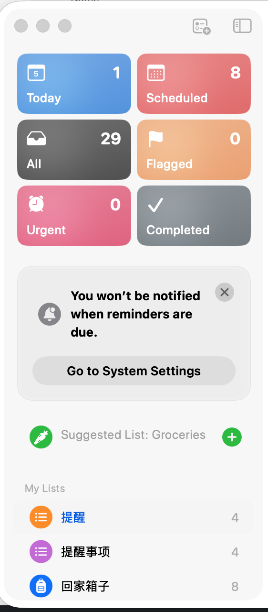

# macOS Overview Information Architecture

Implemented for the local 0.2.4 UI iteration, following the user reference supplied
on 2026-09-05. The main window combines a two-column category overview, native
session rows, and a selected message surface.

## User Reference

The reference establishes compact icon/count tiles, clear separation between
categories and grouped lists, and navigation that works in narrow windows.
The implementation uses native SwiftUI buttons and lists, semantic typography,
and bright, glazed category colors. Diagonal highlights and fine reflective edges
provide the glass-like finish requested during review; dark ink keeps labels
readable on the lighter colors in both appearances.

## Categories and Counts

| Category | Included messages | Destination |
| --- | --- | --- |
| Needs You | The existing ranked attention set | Grouped questions and reply detail |
| Automatic | Attention questions with a running default timer | Questions ordered by deadline |
| Waiting on you | Attention questions waiting without a deadline | Questions ordered by waiting time |
| High priority | High or critical questions in the attention set | Ranked questions, including timed and waiting questions |
| All messages | All recently loaded messages, including replies | Searchable history |
| Completed | Agent-to-boss messages marked replied, resolved, or expired, including expired metadata | Searchable completed history |

Counts and destination lists derive from the same snapshot. High priority can
overlap Automatic or Waiting on you. Completed counts the original question,
not the boss's reply. Counts cover the recent history returned by the existing
API; they are not lifetime totals. Unknown counts use a dash while loading.
A live question missing from history is merged once, and resolved history wins
over an older live copy. A resolution event refreshes history even when the
question is not the currently displayed popup.

The overview snapshot updates only when history or the live question changes,
or at the next attention deadline. One-second clocks are confined to time labels;
they do not rebuild navigation, session groups, or the reply editor. Session sort
keys and attention timestamps are parsed once per projection, and SQL timestamp
formatters are reused.

## Sessions and Navigation

Session rows use stable session IDs and the shared grouping rules, including
`targetSessionId` for boss replies and a Direct bucket. Identical labels remain
separate sessions. Each row opens exactly the messages counted beside it.
Changing the selected scope clears the history search and segmented filter.

At 760 points and above, the overview occupies a 280–340 point sidebar. Below
760 points, the Overview toolbar button switches between the full-width overview
and the selected destination. Within the attention area, 720 points enables the
question list and detail side by side. Smaller areas show one surface at a time,
with All questions returning to the list. The minimum window is 480 × 400.

## Replies and States

Question text wraps and scrolls within the available height. The reply composer
stays at the bottom. Command-Return sends a custom instruction. Drafts are keyed
by message ID and held for the main window's lifetime, including category changes.
History detail shares those drafts, retains failed submissions, and closes only
after a successful reply. Resolved questions show read-only choices.

Disconnected, loading, empty-category, empty-completed, and failed-history states
have separate feedback. Cached messages remain available during connection
failures. Main-window text and backgrounds follow the system appearance.

## Verification

Run `swift test --package-path macos` and `swift test --package-path HibossKit`.
The suite covers tile/count agreement, same-label session isolation, live/history
deduplication, local and remote reply transitions, custom drafts, and native editor
bounds at four main-window sizes. History reply failures are rendered at 360 × 320
in both light and dark appearances. Build and inspect the application bundle as
required by the [native design contract](macos-design-v2.md).
`OverviewStoreTests` verifies unchanged-input caching and deadline invalidation.
`OverviewPerformanceTests` measures projection of 100 messages across 20 sessions.
